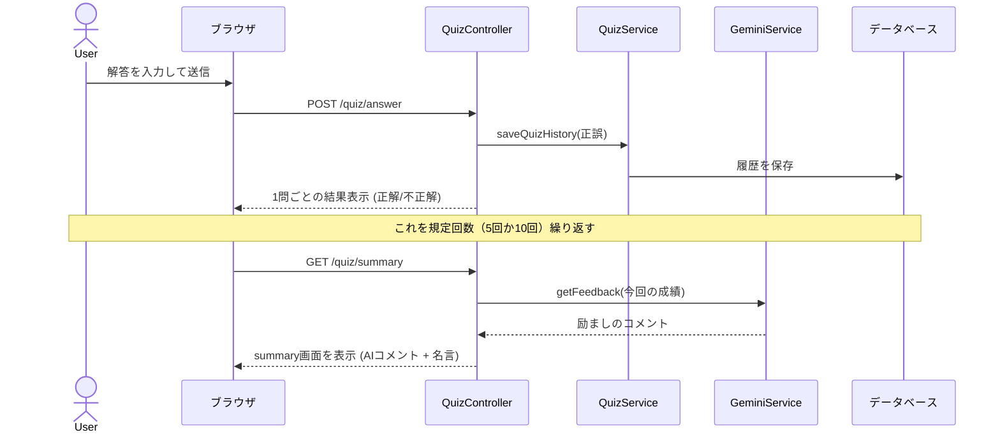

# 🚀 Vocab-Spring システム設計図 (System Blueprint)

このドキュメントでは、汎用単語・用語学習アプリ `My単語帳 VocabularySpring` の全体像を、エンジニアの視点と初学者のわかりやすさを両立して解説します。

---

## 1. システム概要
`My単語帳 VocabularySpring` は、英単語に限らず、専門用語、IT用語、資格試験の対策など、あらゆる「暗記と理解」をサポートする自分専用のデジタル単語帳アプリです。
単語帳一覧による不明単語の確認、AI（Gemini）による学習フィードバックや、詳細な学習統計機能を備え、効率的な知識の定着を支援します。

---

## 2. システムアーキテクチャ
```mermaid
graph TD
    User[ユーザー (ブラウザ)] <--> UI[フロントエンド (Thymeleaf)]
    
    subgraph Spring Boot Application
        UI <--> Controller[Controller層: 窓口]
        Controller <--> Service[Service層: 業務ロジック]
        Service <--> Repository[Repository層: データ操作]
    end
    
    Repository <--> DB[(データベース: H2 Database)]
    Service <--> GeminiAPI[外部API: Google Gemini API]
```

---

## 3. 技術スタック
| カテゴリ | 技術 |
| :--- | :--- |
| **言語** | Java 17 |
| **フレームワーク** | Spring Boot 3.4.x (Security, Data JPA, Validation, Web) |
| **データベース** | H2 Database (開発/テスト用インメモリ) |
| **テンプレートエンジン** | Thymeleaf (HTML5) |
| **スタイリング** | Vanilla CSS (カスタムデザイン) |
| **AI 連携** | Google Gemini API (gemini-2.0-flash) |
| **認証・認可** | Spring Security (Form Login) |
| **ビルドツール** | Maven |

---

## 4. データベース設計
主に4つのテーブルで構成されています。

### ① `users` (ユーザー)
- 役割: ログイン情報とユーザー設定を管理。
- 主なカラム: `id`, `username`, `password`, `email`, `role`

### ② `categories` (カテゴリ)
- 役割: 用語をグループ化するための分類（例：「基本情報技術者」「TOEIC頻出」「医学用語」など）。
- 主なカラム: `id`, `name`, `user_id`(FK)

### ③ `words` (単語・用語)
- 役割: 学習対象の用語データ。
- 主なカラム: `id`, `term` (用語名), `definition` (意味・解説), `example_sentence` (例文・使用例), `user_id`(FK), `category_id`(FK)

### ④ `quiz_histories` (クイズ履歴)
- 役割: クイズの1問ごとの正誤を記録。統計データの元。
- 主なカラム: `id`, `user_id`(FK), `word_id`(FK), `is_correct`, `answered_at`

---

## 5. API / 画面パス 仕様
主要なエンドポイントの役割です。

| 種類 | パス | 役割 |
| :--- | :--- | :--- |
| **ホーム** | `/` | ログイン後のホームページ（学習サマリー表示） |
| **認証** | `/login`, `/register` | ログイン画面、新規会員登録画面 |
| **用語帳** | `/words` | 用語一覧（カテゴリ別グループ表示） |
| **用語操作** | `/words/new`, `/words/edit/{id}` | 用語の新規登録と編集 |
| **クイズ** | `/quiz/settings` | 出題モード（全用語/苦手）や問題数の設定 |
| **クイズ実行** | `/quiz`, `/quiz/answer` | 問題表示と解答処理 |
| **クイズ結果** | `/quiz/summary` | セッション完了後のAIコメントと名言表示 |
| **統計** | `/stats` | 学習の進捗をグラフと数値で可視化 |

---

## 6. AI & インスピレーション機能
学習を楽しく継続するための「知能」と「言葉」の仕組みです。

### AI フィードバック (`GeminiService`)
- クイズ終了時に今回の成績をAIに送信。
- AIが「優しいチューター」として、間違えた用語の意味を補足したり、励ましのコメントを生成します。

### 偉人の名言 (`QuoteService`)
- プログラム内に厳選された名言リスト（エジソン、マンデラ等）を保持。
- 学習の終わりにランダムで表示し、ユーザーのモチベーションを支えます。

---

## 7. プログラムの繋がり図（ファイル相関図）
実際にコードを書く際に、どのファイルが連携しているかを表した図です。

```mermaid
graph LR
    subgraph "画面 (View)"
        HTML["*.html<br/>(Thymeleaf)"]
    end

    subgraph "コントローラー (窓口)"
        QC["QuizController<br/>StatsController<br/>WordController"]
    end

    subgraph "サービス (ロジック)"
        QS["QuizService<br/>(問題選び・履歴)"]
        SS["StatsService<br/>(統計の計算)"]
        GS["GeminiService<br/>(AIとの連携)"]
    end

    subgraph "データ管理 (Persistence)"
        WR["WordRepository"]
        QR["QuizHistoryRepository"]
        E["Word / QuizHistory<br/>(Entity)"]
    end

    HTML <--> QC
    QC --> QS
    QC --> SS
    QS --> WR
    SS --> QR
    QS --> QR
    WR ..> E
    QR ..> E
```

---

## 8. 動作フロー（シーケンス図）
「クイズに答えてから履歴に残り、AIが分析するまで」の流れです。



---

## 9. ファイルの場所マップ (File Location Map)
VS Codeのエクスプローラーで迷ったときのためのガイドです。

```text
vocab-spring (プロジェクトのルート)
 ├── .env                         (← APIキーなどを隠しておく場所)
 ├── src/main/java/com/vocabulary/vocab_spring
 │    ├── config/                 # セキュリティなどの設定
 │    ├── controller/             # ② 各機能の「窓口」
 │    ├── entity/                 # ③ データの「設計図」(Word, User, Category)
 │    ├── repository/             # ④ データベースの「出し入れ係」
 │    ├── service/                # ⑤ みんなに指示を出す「司令塔」
 │    │    ├── QuizService.java      (問題選び・履歴記録)
 │    │    ├── StatsService.java     (グラフ用データの集計)
 │    │    └── GeminiService.java    (AI(Gemini)との通訳)
 │    └── dto/                    # 画面に渡す「集計データ用の中身」
 └── src/main/resources
      ├── application.properties   (システム全体の基本設定)
      └── templates/              # ① HTML（画面そのもの）
           ├── fragments/            (共通パーツ: ヘッダー等)
           └── *.html                (各画面)
```

---

## 10. 全体のまとめ
Vocab-Springは、単なる暗記アプリではなく、**「情報の整理（Entity）」「データの保存（Repository）」「複雑な処理（Service）」「画面の制御（Controller）」**が、プロの開発現場でも通用する「3層アーキテクチャ」に基づいて構築されています。

英語学習はもちろん、IT資格や専門知識の習得など、あらゆる学習シーンで活用できる柔軟な設計になっています。新しい機能を追加したり、開発を進める際は：
1. **Entity**: 扱うデータの項目を決める
2. **Repository**: 保存・取得の命令を作る
3. **Service**: 具体的な判定や計算のルールを作る
4. **Controller**: 画面と情報のやり取りを繋ぐ
5. **HTML**: ユーザーに見える画面を作る

という順番で意識すると、迷わずスムーズに開発を進めることができます。この設計図を「地図」として活用しながら、さらにアプリを成長させていきましょう！
